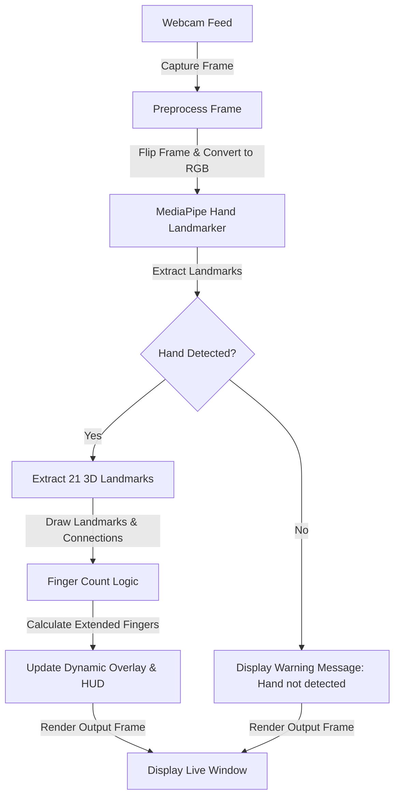

# 🖐️ Real-Time Finger Counter (Computer Vision)

A high-performance, real-time finger counting application built using **OpenCV** and Google's **MediaPipe Hand Landmarker** (Python API). The project detects hands from a webcam feed, tracks 21 landmark points, counts the number of fingers extended, and dynamically displays corresponding HUD indicators and overlay images matching the count (0 to 5).

---

## 🏗️ Project Architecture & Scheme



---

## 📂 File Directory Structure

```text
Finger Counter/
├── .venv/                      # Python virtual environment (if created)
├── Hand_Tracking_Model/        # Core MediaPipe Landmarker module
│   ├── hand_landmarker.task    # Pre-trained MediaPipe Hand Landmarker task bundle
│   └── utils.py                # Wrapper class (handDetector) around MediaPipe API
├── images/                     # Dynamic HUD overlays (images 0.png to 5.png)
│   ├── 0.png
│   ├── 1.png
│   ├── 2.png
│   ├── 3.png
│   ├── 4.png
│   └── 5.png
├── main.py                     # Main application execution script
├── utils.py                    # Utility functions (FPS counter, HUD rendering)
├── requirements.txt            # Python package dependencies
└── readme.md                   # Project documentation (this file)
```

---

## 📄 File Details & Roles

### 1. 🚀 [main.py](file:///Users/wess/Desktop/computer%20vision/Finger%20Counter/main.py)
The central orchestrator of the system. It handles:
* Camera capture initialization (default camera, configured for `1280x720` resolution).
* Loading and scaling the overlay images (`images/0.png` through `images/5.png`) to `200x300` resolution.
* Main event loop: capturing frames, flipping the image to act like a mirror, and passing frames to the hand detector.
* Mapping the counted fingers to the overlay UI elements and displaying the Head-Up Display (HUD) and current FPS.
* Graceful exit when the **Spacebar** is pressed.

### 2. 🛠️ [utils.py](file:///Users/wess/Desktop/computer%20vision/Finger%20Counter/utils.py)
Contains secondary helper functions that keep `main.py` clean:
* `get_fps(cap, pTime, type)`: Calculates current FPS based on frame rendering delta-times or hardware configuration.
* `HUD(img, fingers)`: Draws a semi-transparent background overlay rectangle with white text reflecting the current finger count in the top-right corner.

### 3. 🧠 [Hand_Tracking_Model/utils.py](file:///Users/wess/Desktop/computer%20vision/Finger%20Counter/Hand_Tracking_Model/utils.py)
Encapsulates the **MediaPipe Hand Landmarker** logic:
* Defines custom styles (`custom_dots`, `custom_lines`) for visual hand tracking cues.
* Implements the `handDetector` class which:
  * Initializes the pipeline using `hand_landmarker.task` running in `VIDEO` mode.
  * Resolves 21 coordinate landmark points per detected hand.
  * Standardizes outputs into pixel coordinates list `[id, x, y]`.

---

## 🧮 How the Finger Count Logic Works

The count logic works by tracking relative coordinates between specific landmarks of the hand. 

### Landmark Reference Map
MediaPipe maps hands to **21 landmark points** (indexes 0 to 20):
* **Thumb**: [1, 2, 3, 4] (4 is the tip)
* **Index**: [5, 6, 7, 8] (8 is the tip)
* **Middle**: [9, 10, 11, 12] (12 is the tip)
* **Ring**: [13, 14, 15, 16] (16 is the tip)
* **Pinky**: [17, 18, 19, 20] (20 is the tip)

### Verification Rules
1. **The Four Fingers (Index, Middle, Ring, Pinky)**:
   * Checked vertically. Since the origin `(0,0)` in computer vision screens is in the top-left, y-coordinates increase as you go down.
   * A finger is considered **extended** if its tip landmark's y-coordinate is *smaller* than the joint below it (the PIP joint).
   * **Formula**: `lmList[tip_index][2] < lmList[tip_index - 2][2]` (e.g., `lmList[8][2] < lmList[6][2]` for index finger).
   
2. **The Thumb**:
   * Checked horizontally.
   * A thumb is considered **extended** if its tip landmark's x-coordinate is to the left of the IP joint's x-coordinate (since the frame is flipped horizontally).
   * **Formula**: `lmList[4][1] < lmList[3][1]`.

---

## 🛠️ System Requirements & Setup

### Requirements
* **Python 3.8** or newer
* A functioning webcam
* Pre-compiled dependencies:
  * `opencv-python`
  * `mediapipe`

### Installation & Run Steps

1. **Clone/Navigate to the directory**:
   ```bash
   cd "Finger Counter"
   ```

2. **Create and activate a virtual environment (Recommended)**:
   * **macOS/Linux**:
     ```bash
     python3 -m venv .venv
     source .venv/bin/activate
     ```
   * **Windows**:
     ```bash
     python -m venv .venv
     .venv\Scripts\activate
     ```

3. **Install Dependencies**:
   ```bash
   pip install opencv-python mediapipe
   ```

5. **Launch the Application**:
   ```bash
   python main.py
   ```

### 🎮 Controls
* **Spacebar (` `)**: Press to exit the live window and close the camera feed.
